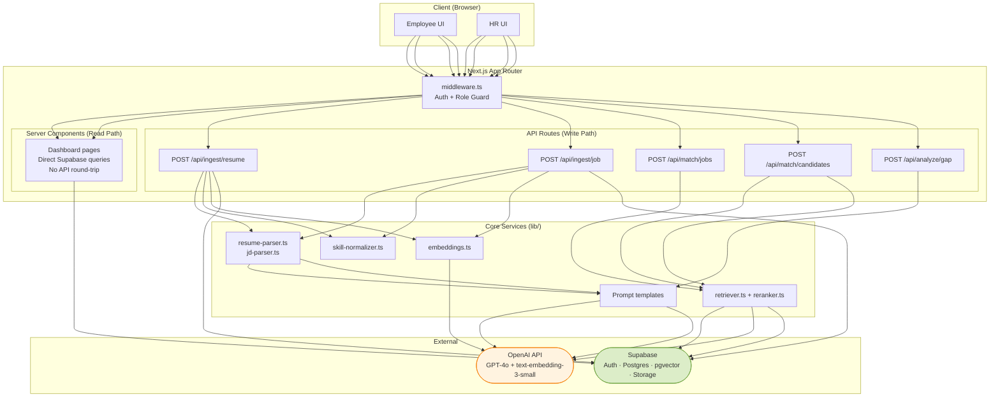
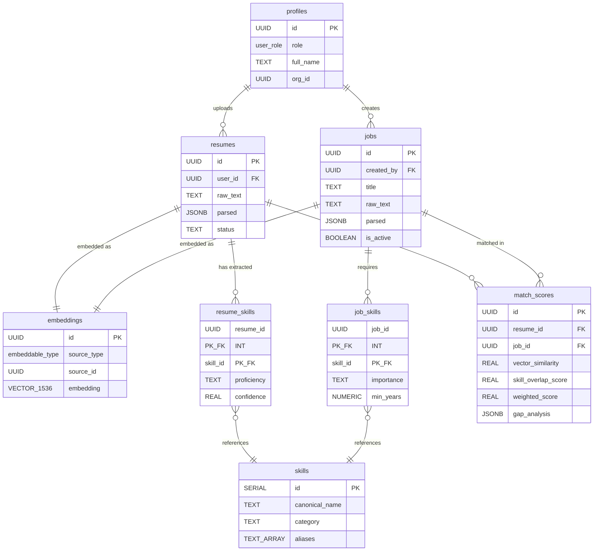

# TalentLens AI — System Architecture

## 1. Folder Structure

```
talentlens-ai/
├── src/
│   ├── app/                              # Next.js App Router
│   │   ├── layout.tsx                    # Root layout with auth provider
│   │   ├── page.tsx                      # Landing / marketing page
│   │   ├── (auth)/
│   │   │   ├── login/page.tsx
│   │   │   ├── signup/page.tsx
│   │   │   └── callback/route.ts         # Supabase OAuth callback
│   │   ├── (employee)/
│   │   │   ├── layout.tsx                # Employee shell (sidebar, nav)
│   │   │   ├── dashboard/page.tsx        # My matches, gap summary
│   │   │   ├── resume/
│   │   │   │   ├── page.tsx              # Upload / paste resume
│   │   │   │   └── [id]/page.tsx         # View parsed resume + extracted skills
│   │   │   ├── matches/
│   │   │   │   ├── page.tsx              # Browse matching JDs
│   │   │   │   └── [id]/page.tsx         # Detailed match + gap analysis
│   │   │   └── skills/page.tsx           # My skill profile (editable)
│   │   ├── (hr)/
│   │   │   ├── layout.tsx                # HR shell
│   │   │   ├── dashboard/page.tsx        # Pipeline overview
│   │   │   ├── jobs/
│   │   │   │   ├── page.tsx              # List all JDs
│   │   │   │   ├── new/page.tsx          # Create / paste JD
│   │   │   │   └── [id]/
│   │   │   │       ├── page.tsx          # View JD + extracted requirements
│   │   │   │       └── candidates/page.tsx  # Ranked candidate matches
│   │   │   └── candidates/
│   │   │       ├── page.tsx              # All candidates (search + filter)
│   │   │       └── [id]/page.tsx         # Candidate detail + fit analysis
│   │   └── api/
│   │       ├── ingest/
│   │       │   ├── resume/route.ts       # POST: parse resume → extract skills → embed
│   │       │   └── job/route.ts          # POST: parse JD → extract requirements → embed
│   │       ├── match/
│   │       │   ├── candidates/route.ts   # POST: find candidates for a JD
│   │       │   └── jobs/route.ts         # POST: find jobs for a candidate
│   │       ├── analyze/
│   │       │   └── gap/route.ts          # POST: gap analysis between resume + JD
│   │       └── webhooks/
│   │           └── process/route.ts      # Supabase Edge Function trigger (async)
│   ├── lib/
│   │   ├── supabase/
│   │   │   ├── client.ts                 # Browser client (createBrowserClient)
│   │   │   ├── server.ts                 # Server client (createServerClient)
│   │   │   ├── admin.ts                  # Service role client (for API routes)
│   │   │   └── middleware.ts             # Auth session refresh
│   │   ├── openai/
│   │   │   ├── client.ts                 # OpenAI client singleton
│   │   │   ├── embeddings.ts             # embed() wrapper
│   │   │   └── prompts/
│   │   │       ├── extract-skills-resume.ts
│   │   │       ├── extract-skills-jd.ts
│   │   │       ├── score-match.ts
│   │   │       └── gap-analysis.ts
│   │   ├── rag/
│   │   │   ├── retriever.ts              # Vector search + rerank
│   │   │   ├── reranker.ts               # LLM-based or cross-encoder rerank
│   │   │   └── context-builder.ts        # Format retrieved docs for prompt
│   │   ├── ingestion/
│   │   │   ├── resume-parser.ts          # HTML/PDF → structured JSON
│   │   │   ├── jd-parser.ts              # JD text → structured JSON
│   │   │   └── skill-normalizer.ts       # "React.js" → "React", dedup, canonicalize
│   │   └── types/
│   │       ├── resume.ts
│   │       ├── job.ts
│   │       ├── skill.ts
│   │       └── match.ts
│   ├── components/
│   │   ├── ui/                           # Shadcn/ui primitives
│   │   ├── resume-upload.tsx
│   │   ├── jd-editor.tsx
│   │   ├── skill-tag-list.tsx
│   │   ├── match-score-card.tsx
│   │   ├── gap-analysis-panel.tsx
│   │   └── candidate-ranking-table.tsx
│   └── middleware.ts                     # Supabase auth + role-based routing
├── supabase/
│   ├── migrations/
│   │   ├── 00001_extensions.sql
│   │   ├── 00002_profiles.sql
│   │   ├── 00003_skills_taxonomy.sql
│   │   ├── 00004_resumes.sql
│   │   ├── 00005_jobs.sql
│   │   ├── 00006_embeddings.sql
│   │   ├── 00007_matches.sql
│   │   ├── 00008_rpc_functions.sql
│   │   └── 00009_rls_policies.sql
│   └── seed.sql                          # Canonical skills taxonomy seed
├── scripts/
│   ├── seed-skills-taxonomy.ts           # One-time: populate skills table
│   └── backfill-embeddings.ts            # Re-embed all docs if model changes
├── .env.local
├── package.json
└── tsconfig.json
```

### Design Rationale

**Why this structure, not the bootcamp's flat layout:**

| Bootcamp | TalentLens | Why |
|---|---|---|
| All logic in `main.py` | Split by domain (`ingestion/`, `rag/`, `openai/prompts/`) | A 942-line monolith is unmaintainable. Each concern gets its own module. |
| Prompts inline in route handlers | Dedicated `prompts/` directory with typed exports | Prompts are code. They need version control, testing, and iteration independent of route logic. |
| Templates with inline JS | React Server Components + Client Components | Type safety, component reuse, proper state management. |
| Single user role | `(employee)/` and `(hr)/` route groups | Next.js route groups give each role its own layout, nav, and middleware without code duplication. |
| No auth | Supabase Auth + RLS + middleware.ts | Multi-tenant from day one. Every query is scoped to the authenticated user's org. |

---

## 2. Backend Architecture



### Key Architectural Decisions

**Read path vs write path separation.** Dashboard pages are React Server Components that query Supabase directly via the server client — zero API route overhead, instant data. Write operations (ingest, match, analyze) go through API routes because they orchestrate multi-step LLM workflows.

**No LLM calls on the read path.** Once a resume is ingested and skills are extracted, the dashboard shows pre-computed data. LLM calls only happen during ingestion and on-demand analysis. This keeps page loads fast.

**Skill normalization is deterministic, not LLM-based.** The bootcamp used an LLM to classify document types. For skills, we need consistency — "React.js", "ReactJS", "React" must all resolve to the same canonical skill. Use a taxonomy table + fuzzy matching, not a $0.01 LLM call per skill.

---

## 3. Database Schema

```sql
-- 00001_extensions.sql
CREATE EXTENSION IF NOT EXISTS vector;
CREATE EXTENSION IF NOT EXISTS pg_trgm;  -- For fuzzy text search on skills


-- 00002_profiles.sql
CREATE TYPE user_role AS ENUM ('employee', 'hr', 'admin');

CREATE TABLE profiles (
    id UUID PRIMARY KEY REFERENCES auth.users(id) ON DELETE CASCADE,
    role user_role NOT NULL DEFAULT 'employee',
    full_name TEXT NOT NULL,
    email TEXT NOT NULL,
    org_id UUID,  -- nullable for now, for future multi-org
    created_at TIMESTAMPTZ NOT NULL DEFAULT now(),
    updated_at TIMESTAMPTZ NOT NULL DEFAULT now()
);


-- 00003_skills_taxonomy.sql
CREATE TABLE skills (
    id SERIAL PRIMARY KEY,
    canonical_name TEXT NOT NULL UNIQUE,       -- "React"
    category TEXT NOT NULL,                     -- "Frontend Framework"
    aliases TEXT[] NOT NULL DEFAULT '{}',       -- {"React.js", "ReactJS", "React 18"}
    created_at TIMESTAMPTZ NOT NULL DEFAULT now()
);

CREATE INDEX idx_skills_aliases ON skills USING GIN (aliases);
CREATE INDEX idx_skills_name_trgm ON skills USING GIN (canonical_name gin_trgm_ops);


-- 00004_resumes.sql
CREATE TABLE resumes (
    id UUID PRIMARY KEY DEFAULT gen_random_uuid(),
    user_id UUID NOT NULL REFERENCES profiles(id) ON DELETE CASCADE,
    raw_text TEXT NOT NULL,                     -- Original input (HTML/text)
    parsed JSONB NOT NULL,                      -- Structured extraction result
    status TEXT NOT NULL DEFAULT 'pending'       -- pending | processing | ready | error
        CHECK (status IN ('pending', 'processing', 'ready', 'error')),
    created_at TIMESTAMPTZ NOT NULL DEFAULT now(),
    updated_at TIMESTAMPTZ NOT NULL DEFAULT now()
);

CREATE INDEX idx_resumes_user ON resumes(user_id);
CREATE INDEX idx_resumes_status ON resumes(status);


-- 00005_jobs.sql
CREATE TABLE jobs (
    id UUID PRIMARY KEY DEFAULT gen_random_uuid(),
    created_by UUID NOT NULL REFERENCES profiles(id),
    title TEXT NOT NULL,
    company TEXT,
    location TEXT,
    seniority TEXT
        CHECK (seniority IN ('junior', 'mid', 'senior', 'staff', 'lead') OR seniority IS NULL),
    raw_text TEXT NOT NULL,                     -- Original JD text
    parsed JSONB NOT NULL,                      -- Structured extraction result
    status TEXT NOT NULL DEFAULT 'pending'
        CHECK (status IN ('pending', 'processing', 'ready', 'error')),
    is_active BOOLEAN NOT NULL DEFAULT true,
    created_at TIMESTAMPTZ NOT NULL DEFAULT now(),
    updated_at TIMESTAMPTZ NOT NULL DEFAULT now()
);

CREATE INDEX idx_jobs_created_by ON jobs(created_by);
CREATE INDEX idx_jobs_active ON jobs(is_active) WHERE is_active = true;


-- 00006_embeddings.sql
-- Unified embedding table — one row per embeddable entity
CREATE TYPE embeddable_type AS ENUM ('resume', 'job');

CREATE TABLE embeddings (
    id UUID PRIMARY KEY DEFAULT gen_random_uuid(),
    source_type embeddable_type NOT NULL,
    source_id UUID NOT NULL,                    -- FK to resumes.id or jobs.id
    content_hash TEXT NOT NULL,                  -- SHA256 of embedded text (for dedup/cache)
    embedding VECTOR(1536) NOT NULL,
    created_at TIMESTAMPTZ NOT NULL DEFAULT now(),

    UNIQUE (source_type, source_id)
);

-- Partial HNSW indexes (same pattern from bootcamp — this was well designed)
CREATE INDEX idx_embed_resume_hnsw
    ON embeddings USING hnsw (embedding vector_cosine_ops)
    WHERE source_type = 'resume';

CREATE INDEX idx_embed_job_hnsw
    ON embeddings USING hnsw (embedding vector_cosine_ops)
    WHERE source_type = 'job';


-- Junction tables for extracted skills
CREATE TABLE resume_skills (
    resume_id UUID NOT NULL REFERENCES resumes(id) ON DELETE CASCADE,
    skill_id INT NOT NULL REFERENCES skills(id),
    proficiency TEXT CHECK (proficiency IN ('beginner', 'intermediate', 'advanced', 'expert')),
    years_experience NUMERIC(3,1),              -- 2.5 years
    source TEXT NOT NULL DEFAULT 'extracted'     -- 'extracted' | 'manual'
        CHECK (source IN ('extracted', 'manual')),
    confidence REAL NOT NULL DEFAULT 1.0,       -- LLM extraction confidence 0-1

    PRIMARY KEY (resume_id, skill_id)
);

CREATE TABLE job_skills (
    job_id UUID NOT NULL REFERENCES jobs(id) ON DELETE CASCADE,
    skill_id INT NOT NULL REFERENCES skills(id),
    importance TEXT NOT NULL DEFAULT 'required'
        CHECK (importance IN ('required', 'preferred', 'nice_to_have')),
    min_years NUMERIC(3,1),

    PRIMARY KEY (job_id, skill_id)
);


-- 00007_matches.sql
-- Pre-computed match scores (written by match endpoint, read by dashboards)
CREATE TABLE match_scores (
    id UUID PRIMARY KEY DEFAULT gen_random_uuid(),
    resume_id UUID NOT NULL REFERENCES resumes(id) ON DELETE CASCADE,
    job_id UUID NOT NULL REFERENCES jobs(id) ON DELETE CASCADE,
    vector_similarity REAL NOT NULL,            -- Raw cosine similarity 0-1
    skill_overlap_score REAL NOT NULL,          -- Jaccard-like skill overlap 0-1
    weighted_score REAL NOT NULL,               -- Final blended score 0-1
    gap_analysis JSONB,                         -- Cached gap analysis result
    created_at TIMESTAMPTZ NOT NULL DEFAULT now(),

    UNIQUE (resume_id, job_id)
);

CREATE INDEX idx_matches_job ON match_scores(job_id, weighted_score DESC);
CREATE INDEX idx_matches_resume ON match_scores(resume_id, weighted_score DESC);


-- 00008_rpc_functions.sql

-- Find matching candidates for a job description
CREATE OR REPLACE FUNCTION match_candidates_for_job(
    query_embedding VECTOR(1536),
    match_count INT DEFAULT 20,
    similarity_floor REAL DEFAULT 0.3
)
RETURNS TABLE (
    resume_id UUID,
    user_id UUID,
    similarity REAL
)
LANGUAGE sql STABLE
AS $$
    SELECT
        e.source_id AS resume_id,
        r.user_id,
        (1 - (e.embedding <=> query_embedding))::REAL AS similarity
    FROM embeddings e
    JOIN resumes r ON r.id = e.source_id AND r.status = 'ready'
    WHERE e.source_type = 'resume'
      AND (1 - (e.embedding <=> query_embedding)) >= similarity_floor
    ORDER BY e.embedding <=> query_embedding
    LIMIT match_count;
$$;

-- Find matching jobs for a resume
CREATE OR REPLACE FUNCTION match_jobs_for_resume(
    query_embedding VECTOR(1536),
    match_count INT DEFAULT 20,
    similarity_floor REAL DEFAULT 0.3
)
RETURNS TABLE (
    job_id UUID,
    title TEXT,
    company TEXT,
    similarity REAL
)
LANGUAGE sql STABLE
AS $$
    SELECT
        e.source_id AS job_id,
        j.title,
        j.company,
        (1 - (e.embedding <=> query_embedding))::REAL AS similarity
    FROM embeddings e
    JOIN jobs j ON j.id = e.source_id AND j.status = 'ready' AND j.is_active = true
    WHERE e.source_type = 'job'
      AND (1 - (e.embedding <=> query_embedding)) >= similarity_floor
    ORDER BY e.embedding <=> query_embedding
    LIMIT match_count;
$$;


-- 00009_rls_policies.sql

ALTER TABLE profiles ENABLE ROW LEVEL SECURITY;
ALTER TABLE resumes ENABLE ROW LEVEL SECURITY;
ALTER TABLE jobs ENABLE ROW LEVEL SECURITY;
ALTER TABLE match_scores ENABLE ROW LEVEL SECURITY;

-- Employees see only their own resumes
CREATE POLICY resumes_employee ON resumes
    FOR ALL USING (user_id = auth.uid());

-- HR sees all resumes (read-only)
CREATE POLICY resumes_hr ON resumes
    FOR SELECT USING (
        EXISTS (SELECT 1 FROM profiles WHERE id = auth.uid() AND role = 'hr')
    );

-- HR manages their own jobs
CREATE POLICY jobs_hr_own ON jobs
    FOR ALL USING (created_by = auth.uid());

-- Employees can read active jobs
CREATE POLICY jobs_employee_read ON jobs
    FOR SELECT USING (is_active = true);

-- Match scores: employees see their own, HR sees matches for their jobs
CREATE POLICY matches_employee ON match_scores
    FOR SELECT USING (
        resume_id IN (SELECT id FROM resumes WHERE user_id = auth.uid())
    );

CREATE POLICY matches_hr ON match_scores
    FOR SELECT USING (
        job_id IN (SELECT id FROM jobs WHERE created_by = auth.uid())
    );
```

### Schema ER Diagram



### Key differences from the bootcamp schema

| Bootcamp (`rag_content`) | TalentLens | Why |
|---|---|---|
| Single table for all embeddings + content | Separate `resumes`, `jobs`, `embeddings` tables | Embeddings are a derived artifact. Source data lives in its own table with its own schema. |
| `context TEXT` stores everything | `parsed JSONB` + separate `raw_text` | Structured data enables SQL filtering. You can query "all resumes with 5+ years experience" without touching the LLM. |
| `user_id INTEGER` always 1 | Real `user_id UUID` with RLS | Multi-tenant from day one. |
| `document_type TEXT` | `source_type ENUM` | Type safety. No silent bugs from typos like `"jod"`. |
| No skill extraction | Normalized `skills` + junction tables | Skills are first-class entities, not buried in text. This enables deterministic skill-overlap scoring without LLM calls. |
| No match persistence | `match_scores` table | Pre-compute and cache. Dashboard reads are instant. |

---

## 4. RAG Design

RAG is used **only for the vector similarity step** of matching. This system is **not a chatbot** — it's a matching engine. The architecture is simpler than the bootcamp's because we don't need classification or dynamic top-k.

### When RAG is used

```
HR creates JD
  → JD embedded → vector stored
  → vector search against resume embeddings → top N candidates
  → skill overlap computed deterministically
  → scores blended and stored in match_scores

Employee uploads resume
  → Resume embedded → vector stored
  → vector search against job embeddings → top N jobs
  → skill overlap computed deterministically
  → scores blended and stored in match_scores
```

### When RAG is NOT used

- Skill extraction: Pure prompt engineering (structured output). No retrieval needed.
- Gap analysis: Pure prompt engineering. Input is two known documents (resume + JD), not a search.
- Dashboard reads: SQL queries on pre-computed `match_scores`.

### The matching algorithm

```typescript
// lib/rag/retriever.ts

export async function findCandidatesForJob(jobId: string): Promise<Match[]> {
  const supabase = createAdminClient()

  // 1. Get the job's embedding
  const { data: jobEmbed } = await supabase
    .from('embeddings')
    .select('embedding')
    .eq('source_type', 'job')
    .eq('source_id', jobId)
    .single()

  // 2. Vector search — cosine similarity via pgvector RPC
  const { data: vectorMatches } = await supabase
    .rpc('match_candidates_for_job', {
      query_embedding: jobEmbed.embedding,
      match_count: 50,
      similarity_floor: 0.3
    })

  // 3. Deterministic skill overlap (no LLM call)
  const jobSkills = await getJobSkills(jobId)
  const scoredMatches = await Promise.all(
    vectorMatches.map(async (vm) => {
      const resumeSkills = await getResumeSkills(vm.resume_id)
      const skillScore = computeSkillOverlap(jobSkills, resumeSkills)
      return {
        resume_id: vm.resume_id,
        vector_similarity: vm.similarity,
        skill_overlap_score: skillScore,
        // 60% skill overlap, 40% semantic similarity
        weighted_score: 0.6 * skillScore + 0.4 * vm.similarity
      }
    })
  )

  // 4. Sort by weighted score, return top 20
  return scoredMatches
    .sort((a, b) => b.weighted_score - a.weighted_score)
    .slice(0, 20)
}
```

**Why no LLM reranking?** The bootcamp used GPT-4o to rerank results. For TalentLens, the skill overlap score IS the reranker — and it's free, deterministic, and explainable. If a candidate has 8/10 required skills, that's a better signal than LLM vibes.

---

## 5. LLM Prompts

### 5a. Skill Extraction — Resume

```typescript
// lib/openai/prompts/extract-skills-resume.ts

export const EXTRACT_SKILLS_RESUME = {
  model: 'gpt-4o' as const,
  temperature: 0,
  response_format: { type: 'json_object' as const },

  system: `You are a technical recruiter's assistant that extracts structured skill data from resumes.

TASK: Extract every technical and professional skill from the resume text.

RULES:
- Use standard industry names (e.g., "React" not "React.js", "PostgreSQL" not "Postgres")
- Infer proficiency from context: years of experience, role seniority, project complexity
- If years are explicitly stated, use them. If not, estimate from work history dates.
- Only extract skills you are confident about. Set confidence < 0.7 for inferred skills.
- Do NOT hallucinate skills not mentioned or clearly implied.
- Categorize each skill into exactly one category.

CATEGORIES: ${SKILL_CATEGORIES.join(', ')}

Return JSON matching this exact schema:`,

  // Function calling enforces the schema
  tools: [{
    type: 'function' as const,
    function: {
      name: 'extract_resume_skills',
      description: 'Extract structured skills from a resume',
      parameters: {
        type: 'object',
        properties: {
          skills: {
            type: 'array',
            items: {
              type: 'object',
              properties: {
                name:            { type: 'string', description: 'Canonical skill name' },
                category:        { type: 'string', enum: SKILL_CATEGORIES },
                proficiency:     { type: 'string', enum: ['beginner','intermediate','advanced','expert'] },
                years_experience:{ type: 'number', description: 'Estimated years, e.g. 2.5' },
                confidence:      { type: 'number', description: '0.0-1.0 extraction confidence' },
                evidence:        { type: 'string', description: 'Quote or context from resume' }
              },
              required: ['name', 'category', 'proficiency', 'confidence']
            }
          },
          summary: {
            type: 'string',
            description: 'One-sentence professional summary'
          },
          total_experience_years: {
            type: 'number',
            description: 'Total years of professional experience'
          }
        },
        required: ['skills', 'summary', 'total_experience_years']
      }
    }
  }]
}

const SKILL_CATEGORIES = [
  'Programming Language',
  'Frontend Framework',
  'Backend Framework',
  'Database',
  'Cloud Platform',
  'DevOps / Infrastructure',
  'Data Engineering',
  'Machine Learning / AI',
  'Soft Skill',
  'Domain Knowledge',
  'Other'
] as const
```

### 5b. Skill Extraction — Job Description

```typescript
// lib/openai/prompts/extract-skills-jd.ts

export const EXTRACT_SKILLS_JD = {
  model: 'gpt-4o' as const,
  temperature: 0,
  response_format: { type: 'json_object' as const },

  system: `You are an HR tech assistant that extracts structured requirements from job descriptions.

TASK: Extract every skill requirement from the job description.

RULES:
- Classify each skill as "required", "preferred", or "nice_to_have"
- Use standard industry names (e.g., "Kubernetes" not "K8s")
- If a minimum years of experience is stated for a skill, include it
- Distinguish between the role's required skills and team/company technologies
  that are only mentioned as context
- Extract both technical skills and soft skills

Return JSON matching this exact schema:`,

  tools: [{
    type: 'function' as const,
    function: {
      name: 'extract_jd_requirements',
      description: 'Extract structured requirements from a job description',
      parameters: {
        type: 'object',
        properties: {
          title:    { type: 'string' },
          company:  { type: 'string' },
          location: { type: 'string' },
          experience_range: {
            type: 'object',
            properties: {
              min_years: { type: 'number' },
              max_years: { type: 'number' }
            }
          },
          skills: {
            type: 'array',
            items: {
              type: 'object',
              properties: {
                name:       { type: 'string' },
                category:   { type: 'string', enum: SKILL_CATEGORIES },
                importance: { type: 'string', enum: ['required','preferred','nice_to_have'] },
                min_years:  { type: 'number', description: 'Minimum years if stated' },
                context:    { type: 'string', description: 'How this skill appears in the JD' }
              },
              required: ['name', 'category', 'importance']
            }
          }
        },
        required: ['title', 'skills']
      }
    }
  }]
}
```

### 5c. Match Scoring (on-demand enrichment, not per-match)

```typescript
// lib/openai/prompts/score-match.ts

export const SCORE_MATCH = {
  model: 'gpt-4o-mini' as const,  // Cheaper model — this runs at scale
  temperature: 0,
  response_format: { type: 'json_object' as const },

  system: `You are evaluating how well a candidate matches a job description.

You will receive:
1. The candidate's extracted skills with proficiency levels
2. The job's required skills with importance levels
3. Pre-computed overlap metrics

Your job is to provide a QUALITATIVE assessment that complements the quantitative scores.

RULES:
- Be specific. Name the skills that match and the skills that are missing.
- Consider transferable skills (e.g., "Flask" experience partially covers "Django" requirement)
- Consider experience level alignment
- Do NOT inflate scores. A junior dev is not a fit for a senior role even if skills overlap.

Return JSON:`,

  tools: [{
    type: 'function' as const,
    function: {
      name: 'assess_match',
      parameters: {
        type: 'object',
        properties: {
          fit_rating: {
            type: 'string',
            enum: ['strong_match', 'good_match', 'partial_match', 'weak_match', 'no_match']
          },
          rationale:        { type: 'string', description: '2-3 sentence explanation' },
          strongest_signals: {
            type: 'array', items: { type: 'string' },
            description: 'Top 3 reasons this candidate fits'
          },
          biggest_gaps: {
            type: 'array', items: { type: 'string' },
            description: 'Top 3 missing requirements'
          },
          transferable_skills: {
            type: 'array',
            items: {
              type: 'object',
              properties: {
                has:     { type: 'string', description: 'Skill the candidate has' },
                covers:  { type: 'string', description: 'Requirement it partially fulfills' },
                overlap: { type: 'number', description: '0-1 how much it covers' }
              }
            }
          }
        },
        required: ['fit_rating', 'rationale', 'strongest_signals', 'biggest_gaps']
      }
    }
  }]
}
```

### 5d. Gap Analysis

```typescript
// lib/openai/prompts/gap-analysis.ts

export const GAP_ANALYSIS = {
  model: 'gpt-4o' as const,  // Full model — this is a high-value, low-frequency call
  temperature: 0.2,            // Slight creativity for learning recommendations
  response_format: { type: 'json_object' as const },

  system: `You are a career development advisor analyzing the gap between a candidate's current skills and a target role's requirements.

TASK: Produce an actionable gap analysis.

RULES:
- Group gaps by severity: critical (blocks hiring), moderate (trainable in 3-6 months), minor (nice-to-have)
- For each gap, suggest specific learning resources or actions
- Estimate realistic time-to-close for each gap
- Consider the candidate's existing skills as a foundation
  (someone with React experience can learn Vue faster)
- Be honest but constructive

Return JSON:`,

  tools: [{
    type: 'function' as const,
    function: {
      name: 'produce_gap_analysis',
      parameters: {
        type: 'object',
        properties: {
          overall_readiness: {
            type: 'string',
            enum: ['ready_now', 'ready_in_3_months', 'ready_in_6_months', 'significant_gap']
          },
          readiness_score:  { type: 'number', description: '0-100' },
          gaps: {
            type: 'array',
            items: {
              type: 'object',
              properties: {
                skill:            { type: 'string' },
                severity:         { type: 'string', enum: ['critical', 'moderate', 'minor'] },
                current_level:    { type: 'string' },
                required_level:   { type: 'string' },
                time_to_close:    { type: 'string', description: 'e.g., "2-3 months"' },
                recommendation:   { type: 'string', description: 'Specific action' }
              },
              required: ['skill', 'severity', 'required_level', 'recommendation']
            }
          },
          strengths: {
            type: 'array',
            items: { type: 'string' },
            description: 'Skills where candidate meets or exceeds requirements'
          },
          suggested_learning_path: {
            type: 'string',
            description: 'Prioritized paragraph: what to learn first, second, third'
          }
        },
        required: ['overall_readiness', 'readiness_score', 'gaps', 'strengths']
      }
    }
  }]
}
```

### Prompt design principles used (vs bootcamp)

| Bootcamp pattern | TalentLens pattern | Improvement |
|---|---|---|
| Prompts are string literals inline in route handlers | Exported typed objects with model, temperature, response_format, and tools co-located | Testable, versionable, type-safe |
| `response_format` OR function calling | Always both | Belt and suspenders — double enforcement |
| No confidence scores | `confidence` field on every extraction | Lets you filter or flag low-confidence extractions |
| No evidence/citation | `evidence` field links extraction to source text | Auditability — critical for HR/recruiting |
| Same model for everything | `gpt-4o` for complex extraction, `gpt-4o-mini` for scoring at scale | 10x cost reduction on high-volume operations |
| Generic system prompts | Domain-specific rules with explicit categories and constraints | Higher precision, fewer hallucinations |

---

## 6. Synchronous vs Asynchronous

| Operation | Sync/Async | Latency | Why |
|---|---|---|---|
| **Resume upload + parse** | **Async** | 5-15s | LLM extraction is slow. Return a job ID immediately, show a progress state, poll or use Supabase Realtime for completion. |
| **JD upload + parse** | **Async** | 3-8s | Same reason. |
| **Skill extraction** | **Async** (part of ingest) | 3-5s | Bundled with parsing. Single LLM call. |
| **Embedding generation** | **Async** (part of ingest) | <1s | Fast, but happens after parsing completes. |
| **Vector search** | **Sync** | <200ms | pgvector with HNSW index is fast. Return results immediately. |
| **Skill overlap scoring** | **Sync** | <50ms | Pure SQL/JS computation. No LLM. |
| **Match list for dashboard** | **Sync** | <100ms | Read from pre-computed `match_scores` table. |
| **Gap analysis** | **Sync** | 3-5s | On-demand, user-initiated. Show a loading state. Acceptable because user explicitly clicked "Analyze Gap". |
| **LLM match assessment** | **Async** or **Lazy** | 2-3s | Compute on first view, cache in `match_scores.gap_analysis`. |

### Implementation pattern for async ingestion

```
User uploads resume
  → POST /api/ingest/resume
  → Insert row into resumes (status: 'pending'), return resume ID immediately
  → Trigger Supabase Edge Function or background job:
      1. Parse raw_text → structured JSON (LLM call)
      2. Extract skills → normalize → insert into resume_skills
      3. Generate embedding → insert into embeddings
      4. Update resume status to 'ready'
      5. Trigger match computation against all active jobs
  → Frontend polls resume status or subscribes via Supabase Realtime
  → When status = 'ready', dashboard hydrates with matches
```

---

## 7. 72-Hour MVP vs Real Implementation

### MUST be real (build these)

| Component | Why it can't be faked |
|---|---|
| Supabase Auth (email/password) | 30 min to set up. Gives you RLS, sessions, and role separation for free. No excuse to skip. |
| Resume text input + LLM extraction | This IS the product. If skill extraction doesn't work, nothing works. |
| JD text input + LLM extraction | Same — the other side of the marketplace. |
| Skills taxonomy table (seeded with ~200 skills) | Deterministic normalization is critical. Without it, "React" and "React.js" are different skills and overlap scoring breaks. |
| Skill overlap scoring (deterministic) | The core value proposition. Simple set intersection math. |
| Vector search via pgvector | Already know the pattern from the bootcamp. Supabase makes this trivial. |
| One dashboard page per role | Employees need to see their matches. HR needs to see candidates. Even if ugly, the data flow must work. |

### FAKE these (hardcode, stub, or defer)

| Component | How to fake it | Why it's okay |
|---|---|---|
| PDF resume parsing | Accept plain text or HTML only. Add PDF support later with `pdf-parse` or Unstructured.io. | PDF parsing is a library problem, not an architecture problem. It doesn't validate your core thesis. |
| Skill normalization (fuzzy matching) | Use exact string matching against your seeded taxonomy. If "React.js" doesn't match "React", manually add it as an alias. | Fuzzy matching (Levenshtein, embeddings) is an optimization. Start with a good alias list. |
| LLM match assessment (qualitative) | Show only the quantitative scores (vector similarity + skill overlap). Skip the "rationale" text. | The numbers alone are useful. The LLM explanation is polish. |
| Gap analysis | Compute it as: `job_skills - resume_skills = gaps`. Show a simple list. Skip the LLM-generated learning path. | Deterministic gap list is 80% of the value. The learning recommendations are nice-to-have. |
| Async ingestion | Make it synchronous. The user waits 5-10 seconds with a loading spinner. | Ugly but functional. Async is an optimization for UX, not a correctness requirement. |
| Multi-org / team features | Hardcode `org_id = null`. Everyone sees everything. | Multi-tenancy is a growth problem. At MVP, you probably have 1 demo org. |
| Email notifications | Skip entirely. | Users are already in the app. |
| Resume/JD edit after upload | Allow delete + re-upload. Don't build inline editing. | Editing structured extraction results is a hard UX problem. Punt it. |
| Weighted score tuning | Hardcode `0.6 * skill + 0.4 * vector`. | You need user feedback data to tune weights. Ship the default, iterate later. |
| Supabase Realtime for async status | Poll every 2 seconds with `setInterval`. | Realtime is better UX but adds complexity. Polling works fine for a demo. |

### 72-hour execution sequence

```
Hour  0-4:   Supabase project setup, schema migrations, Auth config, skills seed
Hour  4-8:   Next.js scaffold, auth flow, middleware, route groups
Hour  8-16:  Ingestion API routes (resume + JD parsing, skill extraction prompts)
Hour 16-20:  Embedding generation, vector search RPC, skill overlap scoring
Hour 20-28:  Employee dashboard + matches page (Server Components reading from DB)
Hour 28-36:  HR dashboard + candidate ranking page
Hour 36-44:  Simple gap analysis (deterministic: missing skills list)
Hour 44-52:  Polish UI, error handling, loading states
Hour 52-60:  Test end-to-end with real resumes and JDs, fix extraction prompt
Hour 60-72:  Deploy to Vercel, test with 3-5 real users, fix bugs
```

The single highest-risk item is **prompt quality for skill extraction**. Budget 4+ hours for iterating on the extraction prompts with real resumes. The bootcamp's prompts were tested against synthetic data — real LinkedIn profiles are messier.
