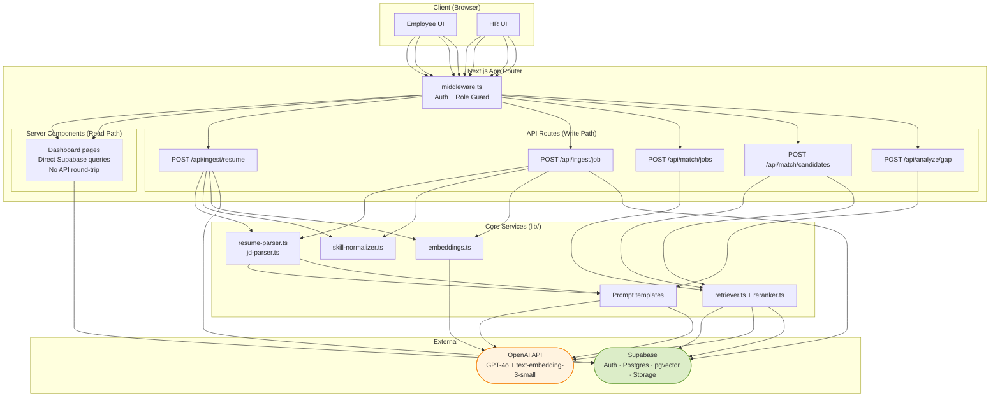
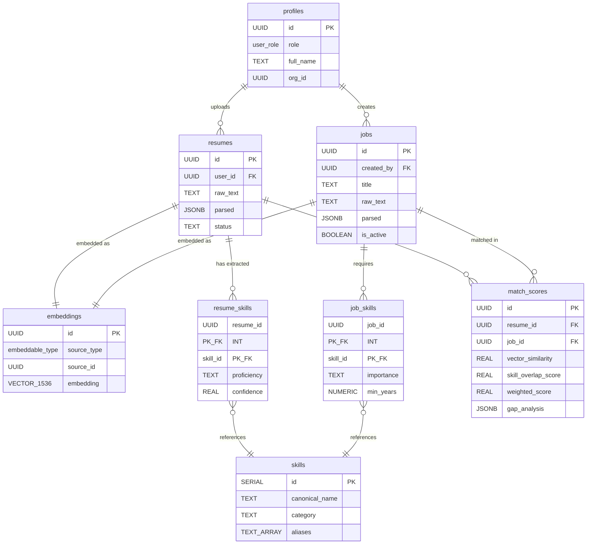

# TalentLens AI

**AI-powered talent matching that works for both sides of the hiring table.**

TalentLens extracts skills from resumes and job descriptions using LLMs, then scores candidate-job fit through a hybrid of semantic vector search and deterministic skill overlap. Employees see which roles they're best suited for and where their gaps are. HR sees a ranked pipeline of candidates for every open position — with explainable scores, not black-box recommendations.

## Demo

**What the demo shows:**

Two parallel flows — an employee uploading a resume and an HR manager posting a job — that converge in a shared matching engine.

**Employee flow:**
- Sign up as an employee
- Paste a resume or LinkedIn profile text
- Watch skills get extracted in real time (with proficiency levels and confidence scores)
- Browse matching job descriptions, ranked by fit
- Open a match to see gap analysis: what's missing, what's strong, how long each gap takes to close

**HR flow:**
- Sign up as HR
- Create a new job description (paste or type)
- See extracted requirements auto-categorized as required / preferred / nice-to-have
- Open the candidate ranking table for that JD
- View weighted scores (skill overlap + semantic similarity) and drill into individual candidate fit

**Key moment to highlight:** After both a resume and a JD are ingested, the match appears on both dashboards simultaneously — the employee sees the job in their matches, and HR sees the candidate in their pipeline.

## Core Concept (The Flywheel)

TalentLens gets better as more people use it — from both sides.

Every resume an employee uploads enriches the candidate pool that HR searches against. Every job description HR posts gives employees more roles to match with. The skills taxonomy grows as new skills are extracted and normalized. Match quality improves as the embedding space becomes denser with real-world data.

This is not a one-sided tool. The value to an employee (finding the right role, understanding their gaps) is directly proportional to the number of JDs in the system. The value to HR (finding qualified candidates quickly) is directly proportional to the number of resumes. Both sides feed each other.

## Features (V1)

### Employee Side
- **Resume ingestion** — paste text or HTML, get structured JSON extraction via GPT-4o with function calling
- **Skill profile** — extracted skills with proficiency levels (beginner/intermediate/advanced/expert), years of experience, and confidence scores
- **Job matching** — browse jobs ranked by weighted fit score
- **Gap analysis** — for any specific job, see missing skills grouped by severity (critical/moderate/minor) with estimated time-to-close

### HR / Admin Side
- **Job description ingestion** — paste JD text, get structured requirements extraction with importance classification (required/preferred/nice-to-have)
- **Candidate ranking** — for any job, see candidates ranked by weighted score with drill-down into individual fit
- **Candidate search** — browse all candidates, filter by skills
- **Pipeline dashboard** — overview of all active jobs and their match counts

### Matching Engine
- **Hybrid scoring** — 60% deterministic skill overlap + 40% semantic vector similarity (cosine distance via pgvector)
- **Skill normalization** — canonical taxonomy with aliases ("React.js" and "ReactJS" resolve to "React")
- **Pre-computed match scores** — dashboards read from a `match_scores` table, not from live LLM calls
- **Similarity floor** — only results with cosine similarity >= 0.3 are returned (no noise)

### Guardrails / Reliability
- **Confidence scores** on every extracted skill (0.0-1.0) — low-confidence extractions can be flagged for review
- **Evidence fields** — each extracted skill links back to the source text it was derived from
- **Schema enforcement** — all LLM outputs use both `response_format: json_object` and function calling (belt and suspenders)
- **Temperature 0** for all extraction prompts — deterministic, reproducible outputs
- **Row Level Security** — employees see only their own data; HR sees candidates and their own jobs

## Tech Stack

| Layer | Technology | Role |
|---|---|---|
| Framework | **Next.js 14+** (App Router) | Server Components for reads, API Routes for writes |
| Database | **Supabase** (Postgres + pgvector) | Auth, structured data, vector search, RLS |
| LLM | **OpenAI API** (GPT-4o, GPT-4o-mini) | Skill extraction, gap analysis, match assessment |
| Embeddings | **text-embedding-3-small** (1536d) | Resume and JD embeddings for semantic matching |
| UI | **Tailwind CSS + shadcn/ui** | Component library |
| Deployment | **Vercel** | Edge-optimized hosting for Next.js |

## System Architecture (High Level)

The system separates the **read path** (dashboards, pre-computed data) from the **write path** (ingestion, matching, analysis):

- **Read path:** React Server Components query Supabase directly. No API route overhead. Dashboards render from pre-computed `match_scores` rows. Zero LLM calls on page load.
- **Write path:** API routes orchestrate multi-step LLM workflows — parsing, extraction, normalization, embedding, scoring. These run during ingestion and on-demand analysis only.

### Ingestion Flow

```
Resume/JD text input
  → LLM structured extraction (GPT-4o + function calling)
  → Skill normalization against canonical taxonomy
  → Skills written to junction tables (resume_skills / job_skills)
  → Embedding generated (text-embedding-3-small, 1536d)
  → Vector stored in embeddings table
  → Match scores computed against all counterparts
  → Scores written to match_scores table
```

### Matching Flow

```
HR views candidates for a job (or employee views matching jobs)
  → Read pre-computed match_scores from Postgres (instant)
  → Optionally trigger on-demand gap analysis (LLM call, cached after first run)
```

### Architecture Diagram



## Database Design

The schema is organized around seven core tables:

| Table | Purpose |
|---|---|
| `profiles` | User accounts linked to Supabase Auth. Each profile has a `role` (employee, hr, admin). |
| `resumes` | Uploaded resumes with `raw_text`, LLM-extracted `parsed` JSONB, and a processing `status`. |
| `jobs` | Job descriptions with the same structure: raw text, parsed extraction, status, `is_active` flag. |
| `skills` | Canonical skills taxonomy (~200+ entries). Each skill has a `canonical_name`, `category`, and `aliases` array for normalization. |
| `resume_skills` | Junction table: which skills a resume contains, with `proficiency`, `years_experience`, and `confidence`. |
| `job_skills` | Junction table: which skills a job requires, with `importance` (required/preferred/nice_to_have) and `min_years`. |
| `embeddings` | Unified vector store. One row per embeddable entity (resume or job). 1536-dimension vectors with partial HNSW indexes per source type. |
| `match_scores` | Pre-computed match results: `vector_similarity`, `skill_overlap_score`, `weighted_score`, and cached `gap_analysis` JSONB. |

**Row Level Security** is enabled on all user-facing tables:
- Employees can only read/write their own resumes and see active jobs
- HR can read all resumes (read-only) and manage their own jobs
- Match scores are visible to the relevant employee or the HR user who owns the job



## Getting Started (Local Dev)

### Prerequisites
- Node.js 18+
- [Supabase CLI](https://supabase.com/docs/guides/cli) (for local dev) or a hosted Supabase project
- An OpenAI API key with access to GPT-4o and embeddings

### Setup

```bash
# 1. Clone and install
git clone <repo-url> talentlens-ai
cd talentlens-ai
npm install

# 2. Create environment file
cp .env.example .env.local
# Fill in the values (see Environment Variables below)

# 3. Start local Supabase (recommended) or use hosted project
npx supabase start

# 4. Run database migrations
npx supabase db push

# 5. Seed the skills taxonomy
npx tsx scripts/seed-skills-taxonomy.ts

# 6. Start the dev server
npm run dev

# 7. Open http://localhost:3000
```

### Optional: backfill embeddings

If you change the embedding model or want to re-embed all existing documents:

```bash
npx tsx scripts/backfill-embeddings.ts
```

## Environment Variables

Create a `.env.local` file with the following:

| Variable | Required | Description |
|---|---|---|
| `NEXT_PUBLIC_SUPABASE_URL` | Yes | Your Supabase project URL |
| `NEXT_PUBLIC_SUPABASE_ANON_KEY` | Yes | Supabase anonymous/public key (safe for browser) |
| `SUPABASE_SERVICE_ROLE_KEY` | Yes | Supabase service role key (server-side only, never exposed to client) |
| `OPENAI_API_KEY` | Yes | OpenAI API key with GPT-4o and embeddings access |
| `NEXT_PUBLIC_APP_URL` | No | Base URL for the app (defaults to `http://localhost:3000`) |

> **Assumption:** If you deploy to Vercel, `NEXT_PUBLIC_APP_URL` should be set to your production domain. All other env vars are set in the Vercel dashboard.

```bash
# .env.local
NEXT_PUBLIC_SUPABASE_URL=http://127.0.0.1:54321
NEXT_PUBLIC_SUPABASE_ANON_KEY=your-anon-key
SUPABASE_SERVICE_ROLE_KEY=your-service-role-key
OPENAI_API_KEY=sk-...
NEXT_PUBLIC_APP_URL=http://localhost:3000
```

## Scripts

| Script | Command | Purpose |
|---|---|---|
| `seed-skills-taxonomy.ts` | `npx tsx scripts/seed-skills-taxonomy.ts` | One-time setup: populates the `skills` table with ~200 canonical skills, categories, and aliases. Run after migrations. |
| `backfill-embeddings.ts` | `npx tsx scripts/backfill-embeddings.ts` | Re-generates embeddings for all resumes and jobs. Use when switching embedding models or recovering from data issues. |

## API Routes (V1)

### `POST /api/ingest/resume`

Parses a resume, extracts skills, generates an embedding, and triggers match computation.

| | Details |
|---|---|
| **Input** | `{ raw_text: string }` — plain text or HTML of the resume |
| **Output** | `{ resume_id: string, status: "processing" }` |
| **What it does** | 1) Insert resume row (status: pending) 2) LLM extraction via GPT-4o function calling 3) Normalize skills against taxonomy 4) Write to `resume_skills` 5) Generate embedding 6) Compute match scores against active jobs 7) Update status to ready |

### `POST /api/ingest/job`

Parses a job description, extracts requirements, generates an embedding, and triggers match computation.

| | Details |
|---|---|
| **Input** | `{ raw_text: string, title?: string, company?: string, location?: string }` |
| **Output** | `{ job_id: string, status: "processing" }` |
| **What it does** | Same pipeline as resume ingestion, but extracts requirements with importance levels (required/preferred/nice_to_have) and writes to `job_skills` |

### `POST /api/match/candidates`

Finds and ranks candidates for a given job.

| | Details |
|---|---|
| **Input** | `{ job_id: string, limit?: number }` |
| **Output** | `{ candidates: Array<{ resume_id, user_name, weighted_score, vector_similarity, skill_overlap_score }> }` |
| **What it does** | 1) Fetch job embedding 2) pgvector cosine search against resume embeddings (similarity floor 0.3) 3) Compute deterministic skill overlap 4) Blend scores (60/40) 5) Return ranked list |

### `POST /api/match/jobs`

Finds and ranks jobs for a given resume.

| | Details |
|---|---|
| **Input** | `{ resume_id: string, limit?: number }` |
| **Output** | `{ jobs: Array<{ job_id, title, company, weighted_score, vector_similarity, skill_overlap_score }> }` |
| **What it does** | Mirror of `/api/match/candidates`, searching job embeddings against the resume embedding |

### `POST /api/analyze/gap`

Produces a detailed gap analysis between a specific resume and job.

| | Details |
|---|---|
| **Input** | `{ resume_id: string, job_id: string }` |
| **Output** | `{ overall_readiness, readiness_score, gaps: Array<{ skill, severity, time_to_close, recommendation }>, strengths, suggested_learning_path }` |
| **What it does** | 1) Fetch extracted skills from both sides 2) Call GPT-4o with gap analysis prompt 3) Cache result in `match_scores.gap_analysis` for future reads |

## Reliability Notes

### Deterministic normalization over LLM classification
Skills are matched against a canonical taxonomy table with aliases, not classified by an LLM at query time. This guarantees that "React.js" always resolves to "React" — no stochastic drift, no cost per lookup.

### Skill overlap as the reranker
The bootcamp architecture used GPT-4o to rerank vector search results. TalentLens replaces this with deterministic skill overlap scoring. If a candidate has 8 out of 10 required skills, that's a stronger, cheaper, and more explainable signal than LLM-generated relevance rankings. Vector similarity handles the softer semantic matching (industry language, narrative style).

### Confidence and evidence fields
Every LLM-extracted skill carries a `confidence` score (0.0-1.0) and an `evidence` field linking back to the source text. This means low-confidence extractions can be flagged for human review, and any extraction can be audited against its source.

### Similarity floor
Both RPC functions (`match_candidates_for_job`, `match_jobs_for_resume`) enforce a similarity floor of 0.3. Results below this threshold are noise and are never returned to the user.

### Pre-computed match scores
Match scores are computed at ingestion time and stored in the `match_scores` table. Dashboard reads are pure SQL queries — no LLM calls, no vector search, sub-100ms response times. Gap analysis is computed on demand (first click) and cached in the same row.

## Roadmap (Post-V1)

- **Async ingestion** — Supabase Edge Functions + Realtime subscriptions for non-blocking resume/JD processing
- **PDF parsing** — Support PDF resume uploads via `pdf-parse` or Unstructured.io
- **Multi-org** — Scope all data to organizations; HR sees only their company's jobs and candidates
- **Eval harness** — Golden dataset of resumes + JDs with human-labeled skill extractions to measure and regression-test prompt quality
- **LLM qualitative match assessment** — GPT-4o-mini generates a 2-3 sentence rationale for each match (strongest signals, biggest gaps, transferable skills)
- **Fuzzy skill normalization** — Levenshtein distance or embedding-based matching for skills not in the taxonomy
- **Weighted score tuning** — A/B test different blending weights (currently hardcoded 60/40) using hiring outcome data
- **Email notifications** — Notify employees of new matching jobs and HR of new matching candidates
